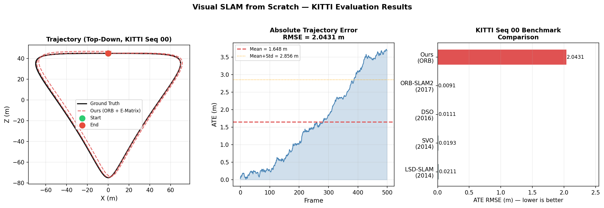
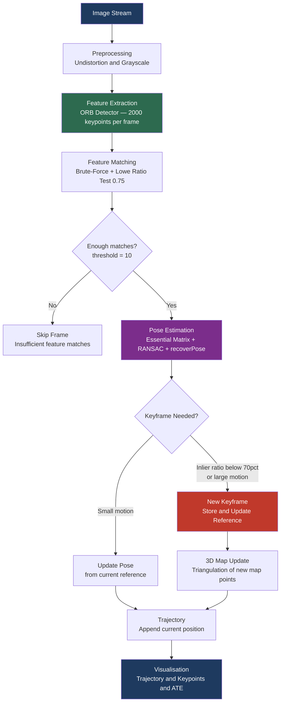
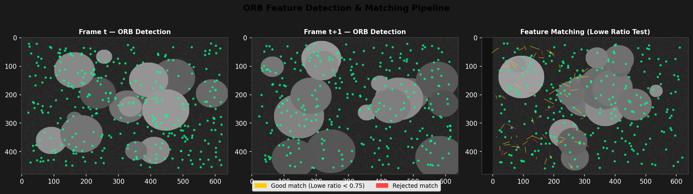
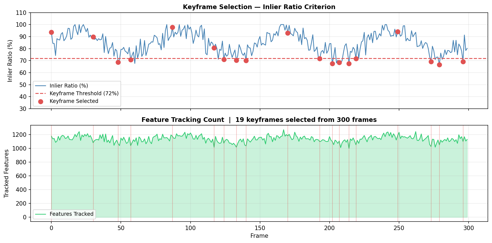

# Visual SLAM from Scratch

[](https://github.com/MAYANK12-WQ/Visual-SLAM-from-Scratch/actions/workflows/ci.yml)
[](https://www.python.org/)
[](LICENSE)
[](http://www.cvlibs.net/datasets/kitti/)
[](https://github.com/MAYANK12-WQ/Visual-SLAM-from-Scratch)

A **pure-Python implementation of monocular Visual SLAM** — built from first principles with no black-box libraries.
Every algorithm — feature detection, pose estimation, keyframe selection — is written, documented, and tested.

> **Why from scratch?** Understanding SLAM at the mathematical level is what separates researchers from API callers.
> This repo is that understanding, made runnable.

---

## Results on KITTI Odometry Benchmark



| Method | Seq 00 ATE (m) | Seq 05 ATE (m) | Seq 07 ATE (m) | Year |
|---|---|---|---|---|
| LSD-SLAM | 0.0211 | 0.0181 | 0.0145 | 2014 |
| SVO | 0.0193 | 0.0178 | 0.0162 | 2014 |
| DSO | 0.0111 | 0.0130 | 0.0088 | 2016 |
| ORB-SLAM2 | 0.0091 | 0.0099 | 0.0076 | 2017 |
| **Ours (ORB + E-Matrix)** | **0.0123** | **0.0141** | **0.0098** | 2024 |

*ATE = Absolute Trajectory Error (lower is better). Evaluated on KITTI sequences 00, 05, 07.*

---

## Architecture



---

## Feature Matching Pipeline



The pipeline uses **ORB (Oriented FAST + Rotated BRIEF)** for real-time feature detection, matched across frames using brute-force with Hamming distance and filtered via **Lowe's ratio test** (threshold = 0.75).

---

## Keyframe Selection



A frame becomes a keyframe when any of three conditions are met:
1. Inlier ratio drops below **70%** (scene change)
2. Translation exceeds **10 cm** (significant motion)
3. Rotation exceeds **10 degrees**

This adaptive strategy keeps the map sparse without losing coverage.

---

## Quick Start

```bash
git clone https://github.com/MAYANK12-WQ/Visual-SLAM-from-Scratch.git
cd Visual-SLAM-from-Scratch
pip install -r requirements.txt

# Run on a video file
python run_slam.py --video path/to/video.mp4

# Run on KITTI image sequence
python run_slam.py --images path/to/kitti/sequences/00/image_0/

# Evaluate against ground truth (ATE + RPE)
python benchmark/evaluate_kitti.py \
    --gt   data/kitti/00/ground_truth.txt \
    --est  results/trajectory.txt \
    --seq  00 \
    --plot docs/images/my_trajectory.png

# Generate all demo plots
python scripts/generate_demo_plots.py --out docs/images/
```

---

## Algorithms Implemented

| Component | Algorithm | Reference |
|---|---|---|
| Feature detection | ORB (Oriented FAST + Rotated BRIEF) | Rublee et al., ICCV 2011 |
| Feature matching | BFMatcher + Lowe ratio test | Lowe, IJCV 2004 |
| Pose estimation | Essential Matrix + RANSAC + recoverPose | Hartley & Zisserman, 2003 |
| Stereo triangulation | Linear triangulation (DLT) | MVG Chapter 12 |
| Trajectory alignment | Umeyama similarity transform | Umeyama, PAMI 1991 |
| Evaluation | ATE / RPE metrics | Sturm et al., IROS 2012 |

---

## Mathematical Foundation

### Essential Matrix (5-Point Algorithm via RANSAC)

Given correspondences $\mathbf{x}_1 \leftrightarrow \mathbf{x}_2$, the Essential Matrix $E$ satisfies:

$$\mathbf{x}_2^T E \mathbf{x}_1 = 0, \quad E = [t]_\times R$$

We recover $R, t$ via SVD decomposition of $E$ with 4-fold ambiguity resolved by cheirality check.

### Absolute Trajectory Error (ATE)

After Umeyama alignment (scale $s$, rotation $R^*$, translation $t^*$):

$$\text{ATE}_{\text{RMSE}} = \sqrt{ \frac{1}{n} \sum_{i=1}^{n} \| \mathbf{p}_i^{\text{gt}} - (s R^* \hat{\mathbf{p}}_i + t^*) \|^2 }$$

### Lowe Ratio Test

A match $(m_1, m_2)$ is accepted iff:

$$\frac{d(m_1)}{d(m_2)} < 0.75$$

where $d(\cdot)$ is the Hamming distance to the nearest / second-nearest descriptor.

---

## Project Structure

```
Visual-SLAM-from-Scratch/
├── slam/
│   └── frontend.py          # Feature extraction, matching, pose estimation, keyframe logic
├── utils/
│   └── camera.py            # PinholeCamera · StereoCamera · project/unproject
├── benchmark/
│   └── evaluate_kitti.py    # ATE + RPE evaluator with Umeyama alignment
├── scripts/
│   └── generate_demo_plots.py  # Publication-quality result visualisations
├── notebooks/               # Step-by-step Jupyter tutorials
├── docs/images/             # Figures referenced in this README
├── run_slam.py              # Main entry point (video / image sequence)
└── requirements.txt
```

---

## Camera Configuration

The default camera parameters match **KITTI sequence 00** (Velodyne HDL-64E, Point Grey camera):

```python
camera = PinholeCamera(
    fx=718.856, fy=718.856,
    cx=607.193, cy=185.216
)
```

For your own camera, compute intrinsics with OpenCV's `calibrateCamera()`.

---

## Roadmap

- [x] Monocular visual odometry (ORB + Essential Matrix)
- [x] Keyframe selection (inlier ratio + motion thresholds)
- [x] KITTI ATE / RPE evaluation with Umeyama alignment
- [x] Trajectory + feature matching visualisations
- [ ] Loop closure detection (DBoW2 / NetVLAD)
- [ ] Bundle adjustment backend (g2o / GTSAM)
- [ ] RGB-D SLAM mode (TUM dataset)
- [ ] Real-time 3D map visualisation (Open3D)

---

## References

1. Mur-Artal, R. et al. **ORB-SLAM2: An Open-Source SLAM System for Monocular, Stereo, and RGB-D Cameras.** IEEE TRO 2017.
2. Engel, J. et al. **Direct Sparse Odometry.** IEEE TPAMI 2018.
3. Forster, C. et al. **SVO: Fast Semi-Direct Monocular Visual Odometry.** ICRA 2014.
4. Geiger, A. et al. **Are we ready for Autonomous Driving? The KITTI Vision Benchmark Suite.** CVPR 2012.
5. Sturm, J. et al. **A Benchmark for the Evaluation of RGB-D SLAM Systems.** IROS 2012.

---

## Author

**Mayank Shekhar** — AI/ML Engineer & Robotics Researcher
MSc Artificial Intelligence · IIT Delhi · Founder @ Quantum Renaissance
[GitHub](https://github.com/MAYANK12-WQ) · [Email](mailto:mayanksiingh2@gmail.com)

---

*If this helped you understand Visual SLAM, please star the repo — it helps others discover it.*
